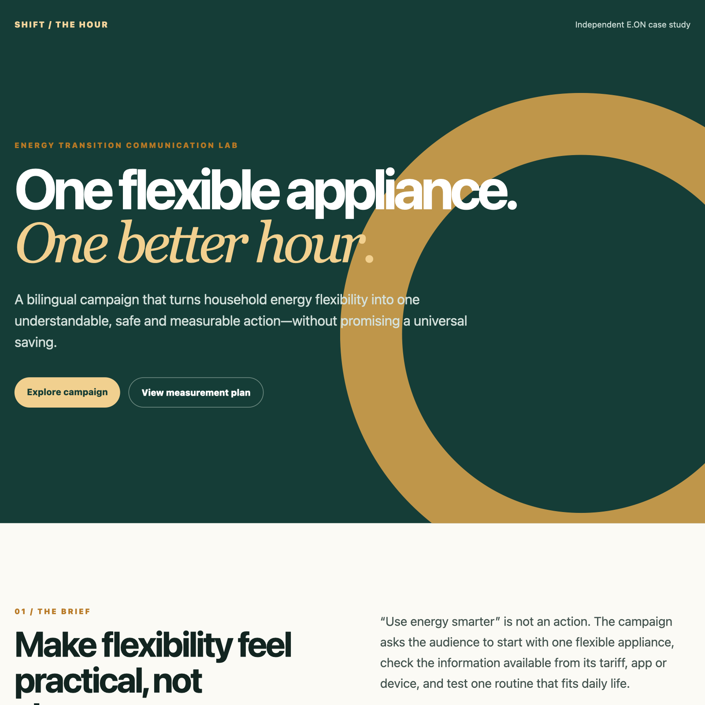

# Energy Transition Communication Lab

**“Shift the Hour”** is an independent, bilingual digital-communication case study for E.ON. It translates household energy flexibility into a four-week social campaign with channel strategy, German/English copy, visual assets, a video storyboard and a measurable KPI framework.

> Independent portfolio work based only on public information. Not commissioned, endorsed or reviewed by E.ON. No E.ON logo, internal material or non-public performance data are used.



## The communication problem

Energy flexibility is technically important but easy to communicate badly: messages become abstract, overly moralising or imply savings that may not apply to every tariff. The campaign uses one concrete behavior—moving flexible appliance use to a better hour—while keeping tariff and household limitations visible.

## Deliverables

- audience and channel strategy
- four-week editorial calendar
- six German and six English social posts
- three original campaign cards
- 60–90 second vertical-video storyboard
- moderation and risk guidance
- KPI framework separating reach, engagement, action and trust
- responsive portfolio microsite

## View locally

```bash
python -m http.server 8000
```

Open `http://localhost:8000/`.

Regenerate the campaign cards:

```bash
python scripts/generate_social_cards.py
```

## Strategic idea

**One flexible appliance. One better hour.**

The campaign avoids promising that shifting always lowers a bill. It explains that the practical benefit depends on tariff, local system conditions, device controls and household needs. The call to action is therefore staged:

1. Understand which loads are flexible.
2. Check tariff or app information.
3. Choose one safe, convenient routine.
4. Review the result after a week.

## Evidence base

- [E.ON Sustainability Factbook 2025](https://annualreport.eon.com/content/dam/eon-annualreport/documents/en/EON%20Sustainability%20Factbook%202025.pdf)
- [E.ON Press & Newsroom](https://www.eon.com/en/ueber-uns/presse.html)
- [Eurostat: household electricity prices, 2025](https://ec.europa.eu/eurostat/web/products-eurostat-news/w/ddn-20260505-1)
- [Eurostat electricity-price metadata](https://ec.europa.eu/eurostat/cache/metadata/EN/nrg_pc_204_sims_me.htm)

The full source notes and claim boundaries are in [`research/public-sources.md`](research/public-sources.md).

## Repository map

```text
index.html, assets/            responsive portfolio microsite
content/campaign-brief.md      audience, proposition, channels and safeguards
content/editorial-calendar.csv four-week publishing plan
content/posts-de.md            German copy set
content/posts-en.md            English copy set
content/video-storyboard.md    short-form video treatment
measurement/kpi-framework.md   measurement and test design
research/public-sources.md     public evidence and claim boundaries
scripts/                       reproducible social-card generation
```

## What is deliberately not claimed

- No campaign results are presented as observed.
- KPI values on the site are planning targets, not E.ON benchmarks.
- No universal household-cost saving is promised.
- The project does not speak on behalf of E.ON.

## License

Original code, copy and artwork are MIT licensed. Third-party names remain the property of their owners.
# energy-transition-communication-lab
Bilingual energy-flexibility campaign with original assets, editorial plan, public-source research and trust KPIs.
